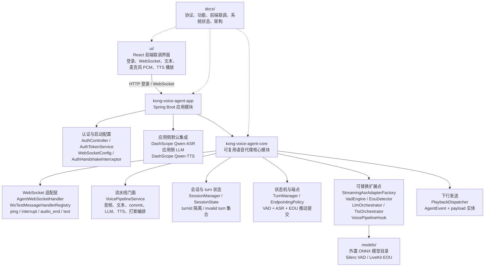
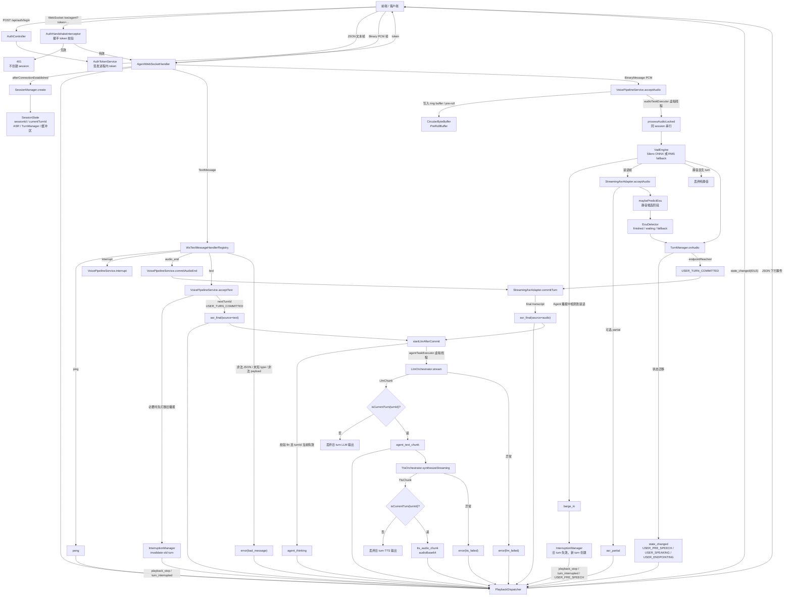

# Architecture

这份文档说明当前 Kong Voice Agent 框架的模块分层，以及一次文本或音频输入从客户端进入系统、经过后端流水线、再流回客户端的完整路径。

## 模块分层

当前分层的核心原则是：`kong-voice-agent-core` 保存稳定协议、状态机、运行态和扩展接口；`kong-voice-agent-app` 负责启动、认证、端点注册和默认服务集成；`ui/` 只作为联调和产品化前端参考，不承载后端 session 状态。

## 数据流总览

## 文本输入路径

1. 客户端发送 `{"type":"text","payload":{"text":"..."}}`。
2. `AgentWebSocketHandler` 解析为 `WsMessage`，交给 `WsTextMessageHandlerRegistry`。
3. `TextWsTextMessageHandler` 调用 `VoicePipelineService.acceptText`。
4. 如果 Agent 正在播报，先通过 `InterruptionManager` 失效旧 `turnId`，并下发 `playback_stop` 与 `turn_interrupted`。
5. 服务端创建新的 `turnId`，状态进入 `USER_TURN_COMMITTED`。
6. 文本输入被包装为 `asr_final(source=text)`，然后进入 `startLlmAfterCommit`。
7. LLM 输出 `agent_text_chunk`，每个非空文本片段继续提交给 TTS。
8. TTS 输出 `tts_audio_chunk(audioBase64)`，客户端按 `turnId` 和 `seq` 播放。

文本路径会跳过 VAD、ASR partial 和 EOU，但不会绕过 `turn committed` 边界。

## 音频输入路径

1. 客户端通过 WebSocket 二进制帧发送 PCM，默认格式为 16kHz / mono / 16-bit PCM little-endian。
2. `AgentWebSocketHandler` 复制二进制载荷，调用 `VoicePipelineService.acceptAudio`。
3. 流水线先写入 `CircularByteBuffer` 和 `PreRollBuffer`，再把耗时处理提交到 `audioTaskExecutor`。
4. 同一个 session 内，`processAudioLocked` 用锁保证 VAD、ASR、TurnManager 按音频帧顺序推进。
5. `VadEngine` 判断是否有人声；如果 Agent 正在播报且检测到用户重新开口，会触发 `barge_in` 打断。
6. 有效音频进入每 session 独立的 `StreamingAsrAdapter.acceptAudio`，真实流式 ASR 可以返回 `asr_partial`。
7. 静音候选阶段，`maybePredictEou` 会在满足最小静音窗口且存在 partial 文本时调用 `EouDetector`。
8. `TurnManager` 结合 VAD、ASR、EOU 和时间窗口产出状态迁移或提交事件。
9. 达到端点后，服务端调用 `StreamingAsrAdapter.commitTurn` 得到最终文本，并下发 `asr_final(source=audio)`。
10. 音频 final 进入同一条 LLM/TTS 下游链路。

## 打断与 turnId 隔离

打断有两种入口：客户端主动发送 `interrupt`，或者 Agent 播报中 VAD 检测到用户重新说话。两者最终都走 `InterruptionManager`：

1. 将旧 `turnId` 放入 invalid turn 集合。
2. 将 `agentSpeaking` 置为 `false`，状态切到 `INTERRUPTED`。
3. 下发 `playback_stop(oldTurnId)` 和 `turn_interrupted(oldTurnId)`。
4. 创建新的 `turnId`，状态切到 `USER_PRE_SPEECH`。

所有 ASR、LLM、TTS 异步结果发布前都必须通过 `SessionState.isCurrentTurn(turnId)` 校验。校验失败的旧结果会被直接丢弃，不再污染当前 turn 的文本、音频或状态。

## 下行事件

后端统一通过 `PlaybackDispatcher` 下发 `AgentEvent`。每条下行 JSON 都带有 `sessionId`、`turnId`、`timestamp` 和事件专属 `payload`。

常见下行事件包括：

- `state_changed`：状态迁移。
- `asr_partial`：流式 ASR 中间结果，只用于展示。
- `asr_final`：最终用户输入，音频为 `source=audio`，文本输入为 `source=text`。
- `agent_thinking`：LLM 开始处理。
- `agent_text_chunk`：Agent 文本片段。
- `tts_audio_chunk`：TTS 音频片段，音频在 `payload.audioBase64`。
- `playback_stop`：停止旧播报。
- `turn_interrupted`：旧 turn 被打断。
- `error`：协议或异步下游错误。
- `pong`：心跳响应。
